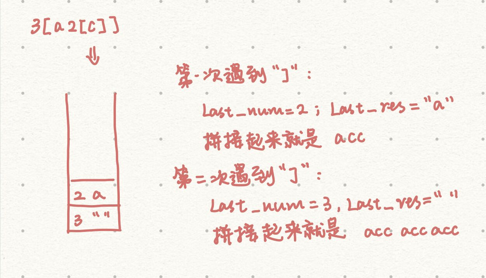
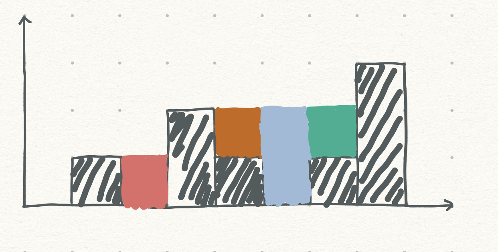
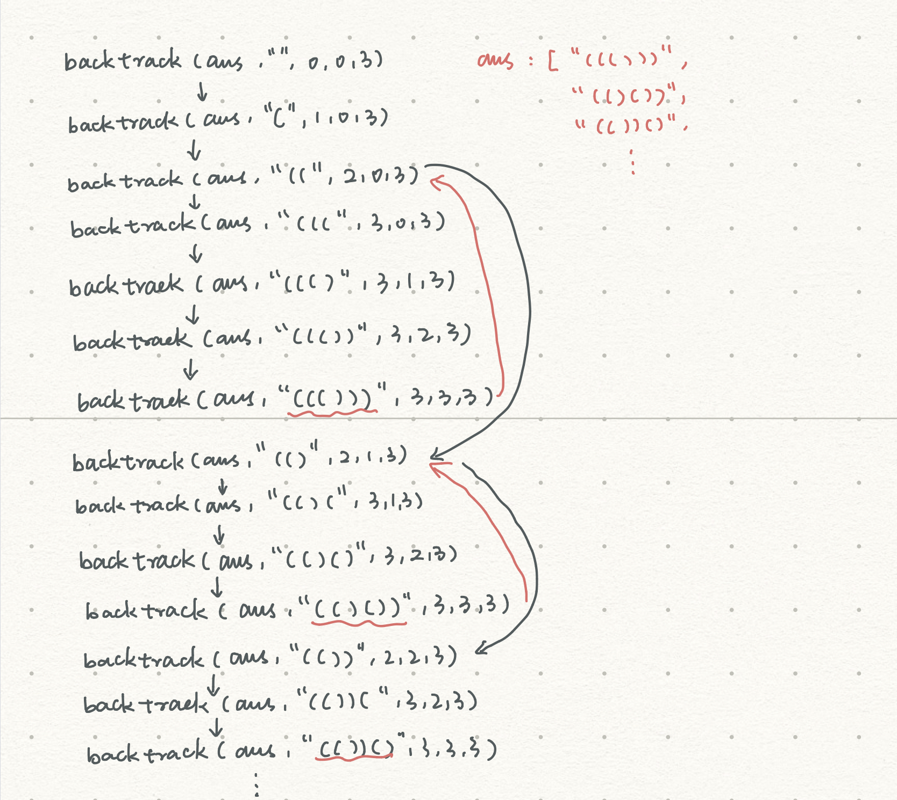

# leetcode总结2

## [字符串解码](https://leetcode-cn.com/problems/decode-string/)

给定一个经过编码的字符串，返回它解码后的字符串。

编码规则为: k[encoded_string]，表示其中方括号内部的 encoded_string 正好重复 k 次。注意 k 保证为正整数。

你可以认为输入字符串总是有效的；输入字符串中没有额外的空格，且输入的方括号总是符合格式要求的。

此外，你可以认为原始数据不包含数字，所有的数字只表示重复的次数 k ，例如不会出现像 3a 或 2[4] 的输入。

示例:

```
s = "3[a]2[bc]", 返回 "aaabcbc".
s = "3[a2[c]]", 返回 "accaccacc".
s = "2[abc]3[cd]ef", 返回 "abcabccdcdcdef".
```


思路：

这种题目很容易会联想到递归。因为有可能会有嵌套，所以，遇到"["符号的时候递归子元素，然后内部如果还有“[”继续递归，直到得到结果后一个个返回。

用栈也可以实现这个方法，但要弄清楚栈当中要存放些什么。因为我们肯定是在遇到“[”符号的时候入栈，所以入栈的时候入的是前面的数字和当前字符串res。当遇到"]"的时候出栈，出的时候，栈顶元素中的数字就是当前字符串的重复次数，然后再在前面拼接上栈顶的字符串。


题解：

**递归：**

```js
/**
 * @param {string} s
 * @return {string}
 */
var decodeString = function(s) {
    s=s.split("");
    function dfs(s,i){
        var i;
        var tmp;
        var res="";
        var multi=0;
        while(i<s.length){
            if("0"<=s[i]&&s[i]<="9"){
                multi=multi*10+Number(s[i]);  //考虑数字大于10的情况
            }
            else if(s[i]=="["){
                [i,tmp]=dfs(s,i+1);
                while(multi--){
                    res+=tmp;
                }
                multi=0;
            }
            else if(s[i]=="]"){
                return [i,res];

            }
            else{
                res+=s[i];
            }
            i++;
        }
        return res;
    }
    return dfs(s,0);
};
```


**栈：**

```js
/**
 * @param {string} s
 * @return {string}
 */
var decodeString = function(s) {
    s=s.split("");
    var sta=[];
    var res="";
    var num=0;
    var last_num;
    var last_res;

    for(let i=0;i<s.length;++i){    
        if(s[i]==="["){
            sta.push([num,res]);
            res="";
            num=0;
        }
        else if(s[i]==="]"){
            var len=sta.length;
            [last_num,last_res]=sta[len-1].slice();     
            sta.pop();
            var temp=res;
            for(let j=0;j<last_num-1;++j){
                res+=temp;
            }
            res=last_res+res;
        }
        else if(s[i]>="0"&&s[i]<="9"){
            num=num*10+Number(s[i]);
        }
        else{
            res+=s[i];
        }
    }
    return res;
};
```





这里要注意的是！不要将两个for循环中的变量设为同一个！比如都是`var i`，因为for不是函数作用域，用var去定义是会相互影响的，最好使用两个不同的变量，同时使用let去声明。


## [接雨水](https://leetcode-cn.com/problems/trapping-rain-water/)

给定 *n* 个非负整数表示每个宽度为 1 的柱子的高度图，计算按此排列的柱子，下雨之后能接多少雨水。


上面是由数组 [0,1,0,2,1,0,1,3,2,1,2,1] 表示的高度图，在这种情况下，可以接 6 个单位的雨水（蓝色部分表示雨水）。 感谢 Marcos 贡献此图。

**示例:**

```
输入: [0,1,0,2,1,0,1,3,2,1,2,1]
输出: 6
```


思路：

这题的思路就是：先找到最高点，分别从两端往最高点遍历，如果下一个元素的值比当前元素小就说明可以接到水。

怎么接雨水：




题解：

```js
/**
 * @param {number[]} height
 * @return {number}
 */
var trap = function(height) {
    //先找出最高点，然后分别从两端开始向最高点遍历
    //当后一个值比当前值要小就说明可以接到水
    var max=0;
    for(var i=0;i<height.length;++i){
        if(height[i]>height[max]){
            max=i;
        }
    }
    var area=0;
    var tmp=height[0];
    for(var i=0;i<max;++i){
        if(height[i]>tmp){
            tmp=height[i];
        }
        else{
            area+=tmp-height[i];
        }
    }
    var len=height.length;
    tmp=height[len-1];
    for(var i=len-1;i>max;i--){
        if(height[i]>tmp){
            tmp=height[i];
        }
        else{
            area+=tmp-height[i];
        }
    }
    return area;
};
```


## [零钱兑换](https://leetcode-cn.com/problems/coin-change/)

给定不同面额的硬币 coins 和一个总金额 amount。编写一个函数来计算可以凑成总金额所需的最少的硬币个数。如果没有任何一种硬币组合能组成总金额，返回 -1。

```
示例 1:

输入: coins = [1, 2, 5], amount = 11
输出: 3 
解释: 11 = 5 + 5 + 1
示例 2:

输入: coins = [2], amount = 3
输出: -1
说明:
你可以认为每种硬币的数量是无限的。
```


思路：
背包问题。我们要凑成总金额amount的话，需要在总金额为amount-`dj`的一堆硬币中加入一个币值为`dj`的硬币。因此我们需要考虑所有的`dj`满足F(n-`dj`)+1最小就可以了。加1代表的是当前的`dj`，F(n-`dj`)就是满足金额`n-dj`最少的硬币数。

因为每种金额所用的硬币数不会超过amount，比如amount为11，那硬币数最多也是11个（11个一元硬币）。那我们就可以将所有的amount的初始硬币数设为amount+1（除了0），那后面如果有更小的硬币数搭配的话，就替换。所以，如果最后F[amount]不是amount+1的话，就说明有更少的硬币组合搭配，如果是amount+1的话，就说明没有，返回-1。这样就不用多设一个变量去监听，每种amount是否有可搭配方案了。


题解：

```js
/**
 * @param {number[]} coins
 * @param {number} amount
 * @return {number}
 */

function min(a,b){
    if(a<=b){
        return a;
    }
    else{
        return b;
    }
}

var coinChange = function(coins, amount) {
    if(amount==0){
        return 0;
    }
    coins.sort(function(a,b){
        return a-b;
    })
    var F=[];
    for(let k=0;k<=amount;++k){
        F[k]=amount+1;
    }
    F[0]=0;
    for(let i=1;i<=amount;++i){
        for(let j=0;j<coins.length;++j){
            if(coins[j]>i){
                break;
            }
            else{
                F[i]=min(F[i-coins[j]]+1,F[i]);
            }
        }
    }
    return F[amount]==amount+1?-1:F[amount];
};
```


## [子集](https://leetcode-cn.com/problems/subsets/)

给定一组不含重复元素的整数数组 nums，返回该数组所有可能的子集（幂集）。

说明：解集不能包含重复的子集。

示例:

```
输入: nums = [1,2,3]
输出:
[
  [3],
  [1],
  [2],
  [1,2,3],
  [1,3],
  [2,3],
  [1,2],
  []
]
```


思路：

构造子集的思路，就是将当前的元素添加到之前的子集当中，从而生成新的子集。比如初始阶段子集应为：[[]]，只有一个空集合（空集是任何集合的子集）。当遍历到元素1的时候，将其添加到之前已有的集合中，构成新的子集：[[],[1]]。


题解：

 ```js
/**
 * @param {number[]} nums
 * @return {number[][]}
 */
var subsets = function(nums) {
    var res=[];
    res.push([]);
    for(var i=0;i<nums.length;++i){
        var len=res.length;
        for(var j=0;j<len;++j){
            var temp=res[j].slice();
            temp.push(nums[i]);
            res.push(temp);
        }
    }
    return res;
};
 ```


## [从前序与中序遍历序列构造二叉树](https://leetcode-cn.com/problems/construct-binary-tree-from-preorder-and-inorder-traversal/)

根据一棵树的前序遍历与中序遍历构造二叉树。

注意:
你可以假设树中没有重复的元素。

例如，给出

```
前序遍历 preorder = [3,9,20,15,7]
中序遍历 inorder = [9,3,15,20,7]
```


返回如下的二叉树：

    	3
       / \
      9  20
        /  \
       15   7


思路：

递归的思想。通过前序遍历我们知道当前数组的根节点是什么，通过中序遍历我们可以知道哪些节点是当前结点的左子树上的结点，哪些节点是当前结点右子树上的结点。


题解：

```c++
/**
 * Definition for a binary tree node.
 * struct TreeNode {
 *     int val;
 *     TreeNode *left;
 *     TreeNode *right;
 *     TreeNode(int x) : val(x), left(NULL), right(NULL) {}
 * };
 */
class Solution {
public:
    TreeNode* buildTree(vector<int>& preorder, vector<int>& inorder) {
        int len=preorder.size();
        if(len==0){
            return NULL;
        }
        vector<int> pre_left,pre_right,in_left,in_right;
        int root=preorder[0];
        TreeNode* res=new TreeNode(root);  //创建一个新的TreeNode结点必须要加上new关键字
        int p=0;
        while(inorder[p]!=root){
            p++; //找到根结点在中序遍历当中的位置
        }
        for(int i=0;i<p;++i){
            //获取左边数组前序遍历和中序遍历的结果
            in_left.push_back(inorder[i]);
            pre_left.push_back(preorder[i+1]);
        }
        for(int j=p+1;j<len;++j){
            //获取右边数组前序遍历和中序遍历的结果
            in_right.push_back(inorder[j]);
            pre_right.push_back(preorder[j]);
        }
        res->left=buildTree(pre_left,in_left);
        res->right=buildTree(pre_right,in_right);
        return res;
    }
};
```


## [用栈实现队列](https://leetcode-cn.com/problems/implement-queue-using-stacks/)

使用栈实现队列的下列操作：

push(x) -- 将一个元素放入队列的尾部。
pop() -- 从队列首部移除元素。
peek() -- 返回队列首部的元素。
empty() -- 返回队列是否为空。
示例:

```
MyQueue queue = new MyQueue();

queue.push(1);
queue.push(2);  
queue.peek();  // 返回 1
queue.pop();   // 返回 1
queue.empty(); // 返回 false
```


说明:

你只能使用标准的栈操作 -- 也就是只有 push to top, peek/pop from top, size, 和 is empty 操作是合法的。
你所使用的语言也许不支持栈。你可以使用 list 或者 deque（双端队列）来模拟一个栈，只要是标准的栈操作即可。
假设所有操作都是有效的 （例如，一个空的队列不会调用 pop 或者 peek 操作）。


思路：

push的话是正常的push进stack1，那pop的时候，如果stack2为空的话，要先将stack1的每个数push到stack再做pop操作。


题解：

```c++
class MyQueue {
private:
    stack<int> s1;
    stack<int> s2;

public:
    /** Initialize your data structure here. */
    MyQueue() {
    }
    
    /** Push element x to the back of queue. */
    void push(int x) {
        s1.push(x);
    }
    
    /** Removes the element from in front of queue and returns that element. */
    int pop() {
        if(s2.empty()){
            while(!s1.empty()){
                s2.push(s1.top());
                s1.pop();
            }
        }
        int res=s2.top();
        s2.pop();
        return res;
    }
    
    /** Get the front element. */
    int peek() {
        if(s2.empty()){
            while(!s1.empty()){
                s2.push(s1.top());
                s1.pop();
            }
        }
        int top_val=s2.top();
        return top_val;
    }
    
    /** Returns whether the queue is empty. */
    bool empty() {
        if(s1.size()==0&&s2.size()==0){
            return true;
        }
        return false;
    }
};

/**
 * Your MyQueue object will be instantiated and called as such:
 * MyQueue* obj = new MyQueue();
 * obj->push(x);
 * int param_2 = obj->pop();
 * int param_3 = obj->peek();
 * bool param_4 = obj->empty();
 */
```


## [括号生成](https://leetcode-cn.com/problems/generate-parentheses/)

给出 n 代表生成括号的对数，请你写出一个函数，使其能够生成所有可能的并且有效的括号组合。

例如，给出 n = 3，生成结果为：

```
[
  "((()))",
  "(()())",
  "(())()",
  "()(())",
  "()()()"
]
```


思路：

回溯法，递归思路。代码挺简单的，但是要想到用这种方法有难度。




题解：

```js
/**
 * @param {number} n
 * @return {string[]}
 */
var generateParenthesis = function(n) {
    //回溯法
    var ans=[];
    generate(ans,"",0,0,n);
    return ans;
};

function generate(ans,str,open,close,n){
    if(str.length==n*2){
        ans.push(str);
    }
    if(open<n){
        generate(ans,str+"(",open+1,close,n);
    }
    if(close<open){
        generate(ans,str+")",open,close+1,n);
    }
}
```


## [排序链表](https://leetcode-cn.com/problems/sort-list/)

在 O(n log n) 时间复杂度和常数级空间复杂度下，对链表进行排序。

```
示例 1:

输入: 4->2->1->3
输出: 1->2->3->4

示例 2:

输入: -1->5->3->4->0
输出: -1->0->3->4->5
```


思路：

对链表进行排序的最好方法就是归并排序，复杂度也是O(nlogn)。这题用递归做的话没办法实现常数空间复杂度，不过递归更好理解一些。

1. 快慢指针，快指针用于判断是否到链表末尾，慢指针用于找链表中点
2. 递归左右链表
3. 归并


题解：

```js
/**
 * Definition for singly-linked list.
 * function ListNode(val) {
 *     this.val = val;
 *     this.next = null;
 * }
 */
/**
 * @param {ListNode} head
 * @return {ListNode}
 */
var sortList = function(head) {
    //使用递归办法空间复杂度没办法是O(1)
    if(head==null||head.next==null){
        return head;
    }
    var slow=head;
    var fast=head.next;
    while(fast!=null&&fast.next!=null){
        slow=slow.next;
        fast=fast.next.next;
    }
    var temp=slow.next;
    var left=sortList(head);
    var right=sortList(temp);
    var h=new ListNode(0);
    var res=h;
    while(left!=null&&right!=null){
        if(left.val<right.val){
            h.next=left;
            left=left.next;
        }
        else{
            h.next=right;
            right=right.next;
        }
        h=h.next;
    }
    h.next=left!=null?left:right;
    return res.next;
};
```


## [用队列实现栈](https://leetcode-cn.com/problems/implement-stack-using-queues/)

使用队列实现栈的下列操作：

push(x) -- 元素 x 入栈
pop() -- 移除栈顶元素
top() -- 获取栈顶元素
empty() -- 返回栈是否为空

注意:

你只能使用队列的基本操作-- 也就是 push to back, peek/pop from front, size, 和 is empty 这些操作是合法的。
你所使用的语言也许不支持队列。 你可以使用 list 或者 deque（双端队列）来模拟一个队列 , 只要是标准的队列操作即可。
你可以假设所有操作都是有效的（例如, 对一个空的栈不会调用 pop 或者 top 操作）。


思路：

这题用双队列是没有用的。因为两个队列都是先进先出，没有把内部的元素翻转过来。所以应该声明一个队列，然后每次对队列push数据的时候，要把在这个数据之前的数据数量记录下来，将它们pop掉再插入队列末尾。


题解：

```c++
class MyStack {
private:
    queue<int> q;

public:
    /** Initialize your data structure here. */
    MyStack() {
    }
    
    /** Push element x onto stack. */
    void push(int x) {
        int count=q.size();
        q.push(x);
        while(count--){
            int temp=q.front();
            q.pop();
            q.push(temp);
        }
    }
    
    /** Removes the element on top of the stack and returns that element. */
    int pop() {
        int res=q.front();
        q.pop();
        return res;
    }
    
    /** Get the top element. */
    int top() {
        return q.front();
    }
    
    /** Returns whether the stack is empty. */
    bool empty() {
        return q.empty()?true:false;
    }
};

/**
 * Your MyStack object will be instantiated and called as such:
 * MyStack* obj = new MyStack();
 * obj->push(x);
 * int param_2 = obj->pop();
 * int param_3 = obj->top();
 * bool param_4 = obj->empty();
 */
```


## [有效的括号](https://leetcode-cn.com/problems/valid-parentheses/)

给定一个只包括 '('，')'，'{'，'}'，'['，']' 的字符串，判断字符串是否有效。

有效字符串需满足：

左括号必须用相同类型的右括号闭合。
左括号必须以正确的顺序闭合。
注意空字符串可被认为是有效字符串。

```
示例 1:
输入: "()"
输出: true

示例 2:
输入: "()[]{}"
输出: true

示例 3:
输入: "(]"
输出: false

示例 4:
输入: "([)]"
输出: false

示例 5:
输入: "{[]}"
输出: true
```


思路：
这题明显是stack的思想。如果是左括号（括号，方括号，花括号），那就压入栈；如果是右括号，就获取当前栈顶元素，如果栈顶元素和这个右括号恰好是匹配的，则pop()，如果不是则return false。如果一一配对之后，stack最后应该是为空的，如果不为空就说明有符号单出来了。还有一些临界条件需要注意：比如")"、")["、""。

如果是要写输入输出用例，则最好写个函数来封装这个判断过程。


题解：

```c++
class Solution {
public:
    bool isValid(string str) {
        stack<char> s;
        int len=str.length();
        if(len==0){
            return true;
        }
        for(int i=0;i<len;++i){
            if(str[i]=='['||str[i]=='('||str[i]=='{'){
                s.push(str[i]);
            }
            else if(str[i]==']'||str[i]==')'||str[i]=='}'){
                if(s.empty()){
                    return false;
                }
                else{
                    if(s.top()=='['&&str[i]==']'){
                    s.pop();
                    }
                    else if(s.top()=='('&&str[i]==')'){
                        s.pop();
                    }
                    else if(s.top()=='{'&&str[i]=='}'){
                        s.pop();
                    }
                    else{
                        return false;
                    }   
                }
            }
        }
        if(s.empty()){
            return true;
        }
        else{
            return false;
        }
    }
};
```


## [腐烂的橘子](https://leetcode-cn.com/problems/rotting-oranges/)

在给定的网格中，每个单元格可以有以下三个值之一：

值 0 代表空单元格；
值 1 代表新鲜橘子；
值 2 代表腐烂的橘子。
每分钟，任何与腐烂的橘子（在 4 个正方向上）相邻的新鲜橘子都会腐烂。

返回直到单元格中没有新鲜橘子为止所必须经过的最小分钟数。如果不可能，返回 -1。

 


示例 1：

```
输入：[[2,1,1],[1,1,0],[0,1,1]]
输出：4
示例 2：

输入：[[2,1,1],[0,1,1],[1,0,1]]
输出：-1
解释：左下角的橘子（第 2 行， 第 0 列）永远不会腐烂，因为腐烂只会发生在 4 个正向上。
示例 3：

输入：[[0,2]]
输出：0
解释：因为 0 分钟时已经没有新鲜橘子了，所以答案就是 0 。
```


提示：

```
1 <= grid.length <= 10
1 <= grid[0].length <= 10
grid`[i][j]` 仅为 0、1 或 2
```


思路：

广度优先搜索。广度优先搜索的话一般会使用队列的思想，最主要还有如何去控制节点去上下左右遍历，所以我们要设置一个locs数组为：[[0,-1],[0,1],[1,0],[-1,0]]，在遍历每个队列元素时，都让它去和locs数组的每个元素进行相加减，得到这个元素上下左右的元素，将为1的元素（即新鲜橙子），变为2（即腐烂橙子）。因为我们要计算时间，但又不能将循环次数用来计时，所以我们将时间和节点的x，y坐标一齐作为一个元素进入队列。


题解：

```js
/**
 * @param {number[][]} grid
 * @return {number}
 */
var orangesRotting = function(grid) {
    var row=grid.length;
    var col=grid[0].length;
    var queue=[];
    var locs=[[0,-1],[0,1],[1,0],[-1,0]];
    var time=0;
    var x,y;
    for(var i=0;i<row;++i){
        for(var j=0;j<col;++j){
            if(grid[i][j]==2){
                queue.push([i,j,time]);
            }
        }
    }
    while(queue.length!==0){
        //这是queue！！不要写成stack,先进先出是用shift
        [x,y,time]=queue.shift();
        for(var t=0;t<locs.length;++t){
            var new_x=x+locs[t][0];
            var new_y=y+locs[t][1];
            if(new_x>=0&&new_x<row&&new_y>=0&&new_y<col){
                if(grid[new_x][new_y]===1){
                    queue.push([new_x,new_y,time+1]);
                    grid[new_x][new_y]=2;
                }
            }
        }
    }
    for(var p=0;p<row;++p){
        for(var q=0;q<col;++q){
            if(grid[p][q]==1){
                return -1;
            }
        }
    }
    return time;
};
```


## [分糖果 II](https://leetcode-cn.com/problems/distribute-candies-to-people/)

排排坐，分糖果。

我们买了一些糖果 candies，打算把它们分给排好队的 n = num_people 个小朋友。

给第一个小朋友 1 颗糖果，第二个小朋友 2 颗，依此类推，直到给最后一个小朋友 n 颗糖果。

然后，我们再回到队伍的起点，给第一个小朋友 n + 1 颗糖果，第二个小朋友 n + 2 颗，依此类推，直到给最后一个小朋友 2 * n 颗糖果。

重复上述过程（每次都比上一次多给出一颗糖果，当到达队伍终点后再次从队伍起点开始），直到我们分完所有的糖果。注意，就算我们手中的剩下糖果数不够（不比前一次发出的糖果多），这些糖果也会全部发给当前的小朋友。

返回一个长度为 num_people、元素之和为 candies 的数组，以表示糖果的最终分发情况（即 ans[i] 表示第 i 个小朋友分到的糖果数）。

 

示例 1：

```
输入：candies = 7, num_people = 4
输出：[1,2,3,1]
解释：
第一次，ans[0] += 1，数组变为 [1,0,0,0]。
第二次，ans[1] += 2，数组变为 [1,2,0,0]。
第三次，ans[2] += 3，数组变为 [1,2,3,0]。
第四次，ans[3] += 1（因为此时只剩下 1 颗糖果），最终数组变为 [1,2,3,1]。
```


示例 2：

```
输入：candies = 10, num_people = 3
输出：[5,2,3]
解释：
第一次，ans[0] += 1，数组变为 [1,0,0]。
第二次，ans[1] += 2，数组变为 [1,2,0]。
第三次，ans[2] += 3，数组变为 [1,2,3]。
第四次，ans[0] += 4，最终数组变为 [5,2,3]。
```


提示：

1 <= candies <= 10^9
1 <= num_people <= 1000


思路：

这题的关键是怎么去对数组进行循环。要用到取模的思想，使用取模可以使得对数组进行循环遍历。


题解：

```js
/**
 * @param {number} candies
 * @param {number} num_people
 * @return {number[]}
 */
var distributeCandies = function(candies, num_people) {
    var res=[];
    for(var k=0;k<num_people;++k){
        res[k]=0;
    }
    var cur=0;
    var count=1;
    while(candies>0){
        if(count<candies){
            res[cur%num_people]+=count;
            candies-=count;
            count++;
            cur++;
        }
        else{
            res[cur%num_people]+=candies;
            candies=0;
        }
    }
    return res;
};
```

